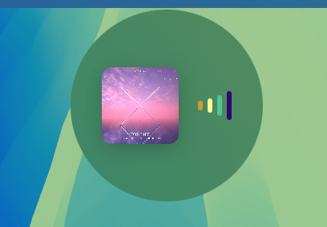
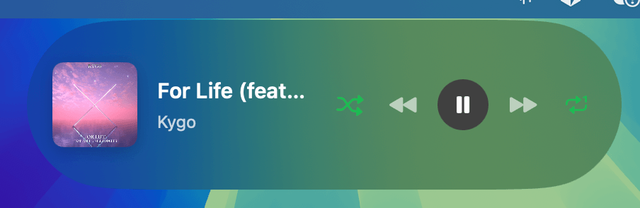

# OzLand - Dynamic Island for Spotify


A beautiful macOS menu bar application that displays the currently playing Spotify track in a floating Dynamic Island-style interface at the top of your screen.

<a href="https://www.buymeacoffee.com/tijNJ98" target="_blank"></a>

## Screenshots

### Compact Mode
The compact view displays album artwork and animated equalizer bars with dynamic colors.



### Expanded Mode
The expanded view shows full track information, album artwork, and complete playback controls including shuffle, repeat, play/pause, and track navigation.



## Installation

### Download (Recommended)

1. Go to [Releases](https://github.com/hakanozkaptan/ozland/releases/latest)
2. Download `OzLand-x.x.x.dmg`
3. Open the DMG and drag OzLand to Applications
4. Launch OzLand from Applications
5. Grant Accessibility permissions when prompted


# Build and run
swift build -c release

# Or create DMG
./scripts/create-dmg.sh 1.0.0
```

## Requirements

- macOS 14.0 (Sonoma) or later
- Spotify Desktop App

## Usage

1. Launch the application
2. Look for the waveform icon in your menu bar (top right)
3. The Dynamic Island will appear at the top center of your screen when Spotify is playing
4. Hover over or click the Dynamic Island to expand it
5. Use the playback controls to control Spotify

### Menu Bar Options

- **Show/Hide** - Toggle Dynamic Island visibility
- **Language** - Switch between English and Turkish
- **Theme** - Choose System, Light, or Dark theme
- **Minimize** - Hide the Dynamic Island
- **Quit** - Exit the application

## Development

### Prerequisites

- macOS 14.0 or later
- Swift 5.9 or later
- Xcode 15.0 or later (optional)

### Building

```bash
# Debug build
swift build

# Release build
swift build -c release
```

### Running Tests

```bash
swift test
```

### Creating a Release

Releases are created automatically via GitHub Actions when a new tag is pushed:

```bash
git tag v1.0.0
git push origin v1.0.0
```

Or manually trigger the release workflow from GitHub Actions.

## Contributing

Contributions are welcome! Please follow the existing code style and architecture patterns.

1. Fork the repository
2. Create your feature branch (`git checkout -b feature/amazing-feature`)
3. Commit your changes (`git commit -m 'Add some amazing feature'`)
4. Push to the branch (`git push origin feature/amazing-feature`)
5. Open a Pull Request

